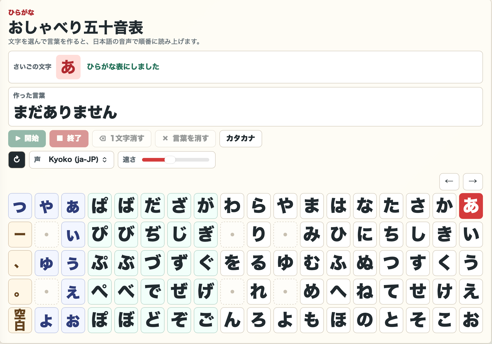

# おしゃべり五十音表
大きな文字でかんたん操作。言葉を作って音声で伝えよう。

ひらがなを選んで言葉を作り、日本語音声で読み上げるWebアプリです。

子どものひらがな学習、高齢者の発声練習、簡単なコミュニケーション支援を目的に作成しました。
## 主な機能

- ひらがな入力
- カタカナ/ひらがな切り替え
- 日本語音声読み上げ
- 読み上げ速度変更
- 1文字削除
- 全削除
- お気に入り登録
- 読み上げ履歴
- カテゴリ別の定型文
- コミュニケーションモード
- スマートフォン対応
- ブラウザだけで利用可能

## バージョン

v1.2.0

- お気に入り機能追加
- 履歴機能追加
- 定型文機能追加
- コミュニケーションモード追加
- UI改善

## 公開ページ

[おしゃべり五十音表を開く](https://mazemon-rin.github.io/hiragana-speech-app/)

## 著作権・利用条件

Copyright © 2026 mazemon-rin. All rights reserved.

このアプリのソースコード、画面デザイン、画像、文章、その他すべてのコンテンツの無断転載・複製・改変・再配布・商用利用を禁じます。

個人での閲覧および作者が公開しているページ上での通常利用はできます。それ以外の利用を希望する場合は、作者の許可を得てください。
